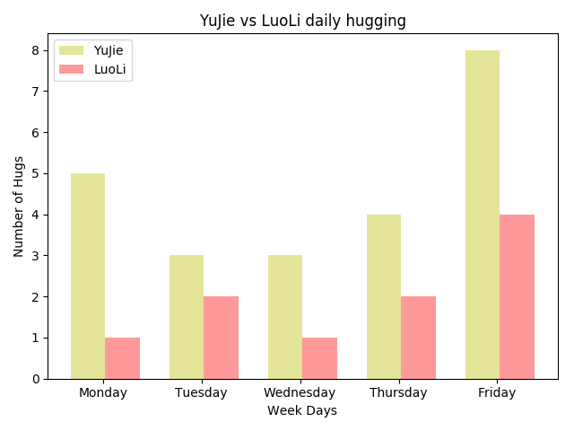
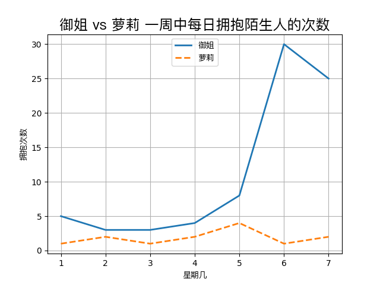
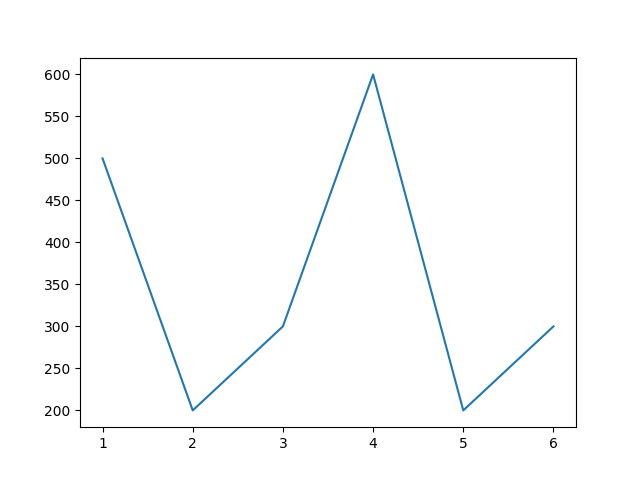
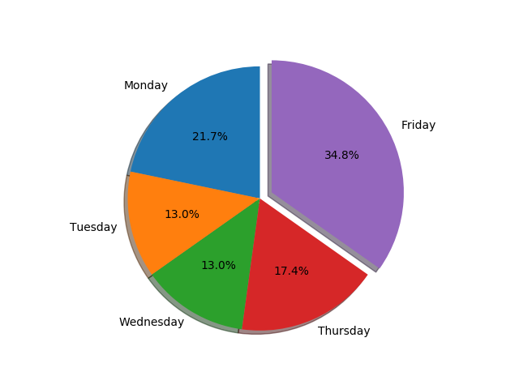

#Matplotlib

Matplotlib [http://matplotlib.org](http://matplotlib.org) 算是python最出名的数据绘图程序的。其功能强大，文档齐全。这里就做一个最简单的介绍

## 安装

当然是要安装的了，最简单的就是直接pip做安装

~~~
pip install matplotlib
~~~

不简单的方法？也有, Matplotlib 有专门的安装文档，介绍了各种简单跟不简单的安装方式：[http://matplotlib.org/users/installing.html](http://matplotlib.org/users/installing.html)

## 个人设定

matplotlib可以自己做很多配置，这个配置可以放在你的 ~/.matplotlib/matplotlibrc中。猫哥自己一般只丢一个backend的设定。设定同样也可以直接在代码中完成，不过如果说你常用的一些设定，避免每次代码都要去设定，直接丢matplotlibrc就好了。

~~~
mkdir ~/.matplotlib 
echo "backend: AGG" >> ~/.matplotlib/matplotlibrc 
~~~

如果对个个设定有兴趣，matplotlib也有完整的文档介绍如何设定matplotlib的：[http://matplotlib.org/users/customizing.html](http://matplotlib.org/users/customizing.html)

## 画图吧

### bar chart

最长见的视图了，这里来做个简单的，一个星期，周一到周五，抱到了几个御姐几个萝莉。简单明了，yujie记录了每天抱到的御姐的数量，萝莉记录的是萝莉的数量，weekday是天数。所有的东西放在一起，图片就出来了。其中label是各个的标签，不难通过视图跟代码对照，找出哪个是哪个。
最后的plt.savefig()告诉matplotlib我们要把图片保存到bar.png这个文件

[bar.py](../src/matplotlib/bar.py)

~~~python
#!/usr/bin/python
import matplotlib.pyplot as plt

def barChart():
    n_groups = 5
    yujie = (5, 3, 3, 4, 8)
    luoli = (1, 2, 1, 2, 4)
    weekday = ('Monday', 'Tuesday', 'Wednesday', 'Thursday', 'Friday')
    fig, ax = plt.subplots()
    index = [x for x in range(n_groups)]
    bar_width = 0.35
    opacity = 0.4
    error_config = {'ecolor': '0.3'}
    rects1 = plt.bar(index, yujie, bar_width,
                     alpha=opacity,
                     color='y',
                     error_kw=error_config,
                     label= u'YuJie')
    rects2 = plt.bar([x+bar_width for x in index] , luoli, bar_width,
                     alpha=opacity,
                     color='r',
                     error_kw=error_config,
                     label=u'LuoLi')
    plt.xlabel('Week Days')
    plt.ylabel('Number of Hugs')
    plt.title('YuJie vs LuoLi daily hugging')
    plt.xticks([x+bar_width-0.2 for x in index], weekday)
    plt.legend()
    plt.tight_layout()
    plt.savefig('bar.png')

if __name__ == '__main__':
    barChart()
~~~

### line chart

同样数据，换个line chart试试看。多加上2天，毕竟周末了，御姐家里管的松点，萝莉家里似乎管的比较紧。

这个是更改了一下代码风格。因为似乎不少人问我怎么画中文的东西（什么安装字体，什么覆盖内置字体的）没那么复杂，不就是写个脚本嘛。还要去改系统了。matplotlib 自身就提供了字体管理（font_manager）

另外有不少人似乎好奇 python 是否可以用中文（变量，函数，类。。等等）可以的。python3 从 2008 年开始就支持了。这里就顺便演示一下。（当然了，个人觉得写起来比较别扭，还要切换输入法，不过也许没准说不定有人喜欢呢）

[line.py](../src/matplotlib/line.py)

~~~python
#/usr/bin/env python3
# encoding = 'utf-8'
"""
有人问如何画图用中文。也有人问，是否代码可以用中文
这个就当做一个示例吧。不过中文代码（变量）是有点别扭的
这个代码需要 python3 才可以。python2 并不支持中文变量
"""

import matplotlib.font_manager as 字体管理
import matplotlib.pyplot as 绘图

def 御姐萝莉曲线图():
    # 这里使用的是苹果的一个字体的路径。其他系统路径请自行调整
    中文字体 = 字体管理.FontProperties(fname='/System/Library/Fonts/PingFang.ttc')
    周几 = ('1','2','3','4','5', '6', '7')
    御姐 = (5, 3, 3, 4, 8, 30, 25)
    萝莉 = (1, 2, 1, 2, 4, 1, 2)

    _ ,御姐萝莉图 = 绘图.subplots()
    御姐萝莉图.plot(周几, 御姐, linewidth=2, label='御姐')
    御姐萝莉图.plot(周几, 萝莉, '--', linewidth=2, label='萝莉')

    御姐萝莉图.legend(loc='upper center', prop=中文字体) #location of line label
    绘图.title('御姐 vs 萝莉 一周中每日拥抱陌生人的次数', fontproperties=中文字体, size='xx-large')
    绘图.xlabel('星期几', fontproperties=中文字体)
    绘图.ylabel('拥抱次数', fontproperties=中文字体)
    绘图.grid(True)
    绘图.savefig("line.png")

if __name__ == '__main__':
    御姐萝莉曲线图()
~~~

其实呢，画图是可以很简单的，简单到什么程度呢？两行代码，是的，就两行就够了。好吧，加上import是3行，如果在加上python的头文件那么就是4行。

[line_basic.py](../src/matplotlib/line_basic.py)

~~~python
#/usr/bin/python
import matplotlib.pyplot as plt
plt.plot([1, 2, 3, 4, 5, 6], [500, 200, 300, 600, 200, 300])
plt.savefig("line_basic.png")
~~~

### pie chart

画饼，这个是我最喜欢的，画饼，这个是可以充饥的呀。因为一饼容不得二虎，所以大饼图就先不带萝莉玩了。通过大饼图就能看书，周五我是比较受欢迎的，整个星期34.8%的拥抱都是在周五得到的。

简单的说两个，第一个是 explode 这个选择，这个是决定哪个部分的图“突出”来，例如我们的 [0, 0, 0, 0, 0.1] 就是说第五个数据（御姐中的那个8）图片pop （突出）。一般来说的做法，是直接代码分析一下数据，然后自动生成你要pop的地方（例如最大数据，又或者最小数据，又或者平均数据，又或者一样的数据）这个 0.1 的值，决定pop出去多少。自己玩玩就明白了。另外一个就是ax1.axis('equal') 这个确定你的饼没有被摔过。同理，自己试试看去掉这行的结果，就可以看出来

[pie.py](../src/matplotlib/pie.py)

~~~python
#!/usr/bin/python
import matplotlib.pyplot as plt

def pieChart():
    yujie = (5, 3, 3, 4, 8)
    weekday = ('Monday', 'Tuesday', 'Wednesday', 'Thursday', 'Friday')
    fig1, ax1 = plt.subplots()
    ax1.pie(yujie, explode=[0, 0, 0, 0, 0.1], labels=weekday, autopct='%1.1f%%', shadow=True, startangle=90)
    ax1.axis('equal')
    plt.savefig('pie.png')

if __name__ == '__main__':
    pieChart()
~~~

## 总结

是的，到这里就没了，猫哥不是很厚道，就只给说了个最基础的东西。完整的介绍，包括很多例子还有视图，都可以在matplotlib的官网看到。之所以我只有介绍这么一点点，是因为，我不会！我画图只是很业余很业余的，偶尔需要用到了，才话一下，就只有画过line，bar跟pie的chart，所以就只写这些了。

